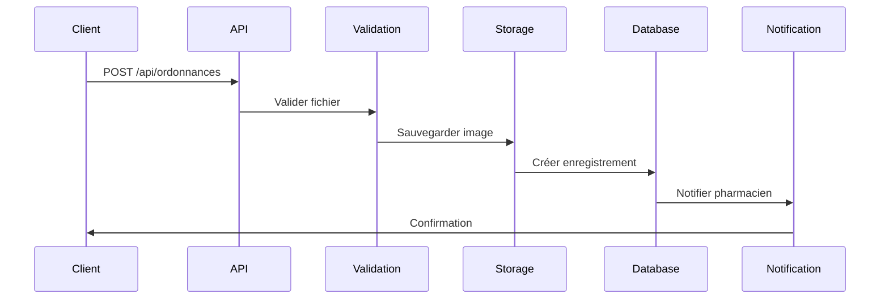
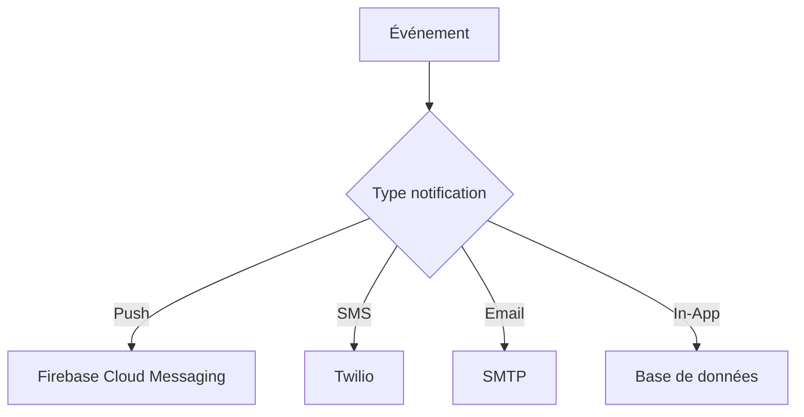

# 📚 DOCUMENTATION SOUTENANCE - PARTIE 2: FONCTIONNALITÉS

## 🎯 FONCTIONNALITÉS PRINCIPALES

---

## 1️⃣ UPLOAD D'ORDONNANCES

### Architecture technique



### Implémentation

**Contrôleur:** `app/Http/Controllers/Api/OrdonnanceController.php`

```php
public function store(Request $request)
{
    // 1. Validation
    $validated = $request->validate([
        'pharmacie_id' => 'required|exists:pharmacies,id',
        'photo_ordonnance' => 'required',
        'commentaire' => 'nullable|string|max:500'
    ]);
    
    // 2. Vérification pharmacie validée
    $pharmacie = Pharmacie::find($validated['pharmacie_id']);
    if ($pharmacie->statut_validation !== 'approved') {
        return response()->json(['message' => 'Pharmacie non validée'], 403);
    }
    
    // 3. Vérification rôle client
    if ($request->user()->role !== 'client') {
        return response()->json(['message' => 'Accès refusé'], 403);
    }
    
    // 4. Upload fichier (2 méthodes supportées)
    if ($request->hasFile('photo_ordonnance')) {
        // Méthode 1: Upload direct depuis mobile
        $photoPath = $request->file('photo_ordonnance')->store('ordonnances', 'public');
    } else {
        // Méthode 2: Base64 depuis mobile
        $imageData = $validated['photo_ordonnance'];
        if (preg_match('/^data:image\/(\w+);base64,/', $imageData, $type)) {
            $imageData = substr($imageData, strpos($imageData, ',') + 1);
            $type = strtolower($type[1]);
            
            if (!in_array($type, ['jpg', 'jpeg', 'png'])) {
                return response()->json(['message' => 'Format non supporté'], 422);
            }
            
            $imageData = base64_decode($imageData);
            $fileName = 'ordonnance_' . time() . '.' . $type;
            $photoPath = 'ordonnances/' . $fileName;
            
            Storage::disk('public')->put($photoPath, $imageData);
        }
    }
    
    // 5. Création ordonnance
    $ordonnance = Ordonnance::create([
        'client_id' => $client->id,
        'pharmacie_id' => $validated['pharmacie_id'],
        'photo_url' => $photoPath,
        'statut' => 'envoyee',
        'date_envoi' => now(),
        'commentaire' => $validated['commentaire'] ?? null
    ]);
    
    return response()->json([
        'message' => 'Ordonnance envoyée avec succès',
        'ordonnance' => $ordonnance
    ], 201);
}
```

### Formats supportés

| Format | Taille max | Méthode |
|--------|------------|---------|
| JPEG | 2 MB | File upload ou Base64 |
| PNG | 2 MB | File upload ou Base64 |
| JPG | 2 MB | File upload ou Base64 |

### Stockage

```php
// Configuration: config/filesystems.php
'disks' => [
    'public' => [
        'driver' => 'local',
        'root' => storage_path('app/public'),
        'url' => env('APP_URL').'/storage',
        'visibility' => 'public',
    ],
]

// Structure de stockage
storage/app/public/ordonnances/
├── ordonnance_1234567890.jpg
├── ordonnance_1234567891.png
└── ordonnance_1234567892.jpg
```

### Sécurité

**1. Validation du type MIME:**
```php
$request->validate([
    'photo_ordonnance' => 'required|image|mimes:jpeg,png,jpg|max:2048'
]);
```

**2. Nettoyage du nom de fichier:**
```php
$fileName = 'ordonnance_' . time() . '.' . $extension;
// Évite les injections de chemin
```

**3. Vérification des permissions:**
```php
if ($request->user()->role !== 'client') {
    return response()->json(['message' => 'Accès refusé'], 403);
}
```

**4. Isolation par utilisateur:**
```php
// Seul le client propriétaire peut voir son ordonnance
$ordonnance = Ordonnance::where('client_id', $client->id)->find($id);
```

### Workflow complet

```
1. Client prend photo ordonnance
   ↓
2. Upload via API (multipart/form-data ou base64)
   ↓
3. Validation format et taille
   ↓
4. Stockage dans storage/app/public/ordonnances/
   ↓
5. Création enregistrement DB avec chemin
   ↓
6. Notification pharmacien (SMS + Push)
   ↓
7. Pharmacien consulte ordonnance
   ↓
8. Pharmacien valide ou rejette
   ↓
9. Notification client du résultat
```

---

## 2️⃣ VALIDATION D'ORDONNANCES PAR PHARMACIEN

### Processus de validation

**Endpoint:** `PATCH /api/ordonnances/{id}/valider`

```php
public function valider(Request $request, Ordonnance $ordonnance)
{
    // 1. Vérification rôle
    if ($request->user()->role !== 'pharmacien') {
        return response()->json(['message' => 'Accès refusé'], 403);
    }
    
    // 2. Validation données
    $validated = $request->validate([
        'remarque_pharmacien' => 'nullable|string|max:500',
        'produits' => 'nullable|array',
        'produits.*.produit_id' => 'required_with:produits|exists:produits,id',
        'produits.*.quantite' => 'required_with:produits|integer|min:1'
    ]);
    
    // 3. Mise à jour ordonnance
    $ordonnance->update([
        'statut' => 'validee',
        'date_traitement' => now(),
        'remarque_pharmacien' => $validated['remarque_pharmacien'] ?? null
    ]);
    
    // 4. Création réservation automatique
    $codeRetrait = 'RET-' . strtoupper(substr(md5(uniqid()), 0, 6));
    $reservation = Reservation::create([
        'client_id' => $ordonnance->client_id,
        'pharmacie_id' => $ordonnance->pharmacie_id,
        'ordonnance_id' => $ordonnance->id,
        'date_reservation' => now(),
        'date_expiration' => now()->addHours(24),
        'code_retrait' => $codeRetrait,
        'statut' => 'en_attente',
        'montant_total' => 0
    ]);
    
    // 5. Ajout des produits
    $montantTotal = 0;
    if (isset($validated['produits'])) {
        foreach ($validated['produits'] as $produitData) {
            $produit = Produit::find($produitData['produit_id']);
            $ligneReservation = $reservation->lignesReservation()->create([
                'produit_id' => $produitData['produit_id'],
                'quantite_reservee' => $produitData['quantite'],
                'prix_unitaire' => $produit->prix
            ]);
            $montantTotal += $ligneReservation->getSousTotal();
        }
        $reservation->update(['montant_total' => $montantTotal]);
    }
    
    // 6. Notifications
    $notificationService = new NotificationService();
    $notificationService->notifierOrdonnanceValidee($ordonnance);
    
    return response()->json([
        'message' => 'Ordonnance validée et réservation créée',
        'ordonnance' => $ordonnance,
        'reservation' => $reservation,
        'code_retrait' => $codeRetrait
    ]);
}
```

### Rejet d'ordonnance

**Endpoint:** `PATCH /api/ordonnances/{id}/rejeter`

```php
public function rejeter(Request $request, Ordonnance $ordonnance)
{
    $validated = $request->validate([
        'commentaire' => 'required|string|max:500'
    ]);
    
    $ordonnance->update([
        'statut' => 'rejetee',
        'date_traitement' => now(),
        'commentaire' => $validated['commentaire']
    ]);
    
    // Notification client
    $notificationService = new NotificationService();
    $notificationService->notifierOrdonnanceRejetee($ordonnance);
    
    return response()->json([
        'message' => 'Ordonnance rejetée',
        'ordonnance' => $ordonnance
    ]);
}
```

### Statuts d'ordonnance

| Statut | Description | Actions possibles |
|--------|-------------|-------------------|
| `envoyee` | Ordonnance envoyée par client | Valider, Rejeter |
| `validee` | Validée par pharmacien | Créer réservation |
| `rejetee` | Rejetée par pharmacien | Renvoyer nouvelle |
| `traitee` | Médicaments préparés | Retirer |

---

## 3️⃣ SYSTÈME DE NOTIFICATIONS

### Architecture multi-canal



### Service de notifications

**Fichier:** `app/Services/NotificationService.php`

```php
class NotificationService
{
    public function notifierOrdonnanceValidee($ordonnance)
    {
        $client = $ordonnance->client;
        
        // 1. Notification in-app
        Notification::create([
            'user_id' => $client->user_id,
            'titre' => 'Ordonnance validée',
            'message' => 'Votre ordonnance a été validée',
            'type' => 'ordonnance_validee',
            'data' => json_encode(['ordonnance_id' => $ordonnance->id])
        ]);
        
        // 2. SMS via Twilio
        $smsService = new SmsService();
        $smsService->smsOrdonnanceValidee(
            $client->telephone,
            $ordonnance->pharmacie->nom_pharmacie
        );
        
        // 3. Push notification (si token FCM disponible)
        if ($client->fcm_token) {
            $this->envoyerNotificationPush($client->fcm_token, [
                'title' => 'Ordonnance validée',
                'body' => 'Vos médicaments sont prêts',
                'data' => ['ordonnance_id' => $ordonnance->id]
            ]);
        }
    }
}
```

### Service SMS (Twilio)

**Fichier:** `app/Services/SmsService.php`

```php
class SmsService
{
    private $twilio;
    private $fromNumber;
    
    public function __construct()
    {
        // Mode test: pas d'initialisation Twilio
        if (app()->environment('testing')) {
            $this->twilio = null;
            return;
        }
        
        $this->twilio = new Client(
            env('TWILIO_SID'),
            env('TWILIO_AUTH_TOKEN')
        );
        $this->fromNumber = env('TWILIO_FROM_NUMBER');
    }
    
    public function envoyerSms($numeroTelephone, $message)
    {
        // Mode test: simulation
        if (app()->environment('testing')) {
            return ['success' => true, 'sid' => 'test_sid'];
        }
        
        try {
            $numeroFormate = $this->formaterNumero($numeroTelephone);
            
            $message = $this->twilio->messages->create(
                $numeroFormate,
                [
                    'from' => $this->fromNumber,
                    'body' => $message
                ]
            );
            
            \Log::info('SMS envoyé', ['to' => $numeroFormate, 'sid' => $message->sid]);
            
            return ['success' => true, 'sid' => $message->sid];
        } catch (Exception $e) {
            \Log::error('Erreur SMS', ['error' => $e->getMessage()]);
            return ['success' => false, 'error' => $e->getMessage()];
        }
    }
    
    private function formaterNumero($numero)
    {
        // Nettoyer
        $numero = preg_replace('/[^0-9+]/', '', $numero);
        
        // Format Sénégal: +221XXXXXXXXX
        if (preg_match('/^(77|78|70|76|75)/', $numero)) {
            return '+221' . $numero;
        }
        
        return $numero;
    }
}
```

### Notifications personnalisées

**Fichier:** `app/Services/NotificationPersonnaliseeService.php`

```php
class NotificationPersonnaliseeService
{
    public function notifierNouveauProduitDisponible($userId, $produit, $pharmacie)
    {
        Notification::create([
            'user_id' => $userId,
            'titre' => 'Nouveau produit disponible',
            'message' => "Le produit {$produit->nom_produit} est disponible à {$pharmacie->nom_pharmacie}",
            'type' => 'produit_disponible',
            'data' => json_encode([
                'produit_id' => $produit->id,
                'pharmacie_id' => $pharmacie->id
            ])
        ]);
    }
    
    public function notifierRappelMedicament($userId, $medicament, $heureRappel)
    {
        Notification::create([
            'user_id' => $userId,
            'titre' => 'Rappel médicament',
            'message' => "N'oubliez pas de prendre votre {$medicament} à {$heureRappel}",
            'type' => 'rappel_medicament',
            'data' => json_encode(['medicament' => $medicament, 'heure' => $heureRappel])
        ]);
    }
}
```

### Types de notifications

| Type | Déclencheur | Canaux | Priorité |
|------|-------------|--------|----------|
| `ordonnance_validee` | Pharmacien valide | SMS + Push + In-App | Haute |
| `ordonnance_rejetee` | Pharmacien rejette | SMS + In-App | Haute |
| `reservation_prete` | Médicaments prêts | SMS + Push | Haute |
| `produit_disponible` | Stock mis à jour | In-App | Moyenne |
| `rappel_medicament` | Heure programmée | Push + In-App | Moyenne |
| `promotion` | Campagne marketing | In-App | Basse |

---

## 4️⃣ GÉOLOCALISATION

### Service de géolocalisation

**Fichier:** `app/Services/GeolocationService.php`

```php
class GeolocationService
{
    private $googleMapsApiKey;
    
    public function __construct()
    {
        $this->googleMapsApiKey = env('GOOGLE_MAPS_API_KEY');
    }
    
    // Calcul distance entre 2 points (formule Haversine)
    public function calculateDistance($lat1, $lon1, $lat2, $lon2)
    {
        $earthRadius = 6371; // km
        
        $dLat = deg2rad($lat2 - $lat1);
        $dLon = deg2rad($lon2 - $lon1);
        
        $a = sin($dLat/2) * sin($dLat/2) +
             cos(deg2rad($lat1)) * cos(deg2rad($lat2)) *
             sin($dLon/2) * sin($dLon/2);
        
        $c = 2 * atan2(sqrt($a), sqrt(1-$a));
        
        return $earthRadius * $c;
    }
    
    // Trouver pharmacies proches
    public function findNearbyPharmacies($userLat, $userLon, $radiusKm = 5)
    {
        $pharmacies = Pharmacie::whereNotNull('latitude')
            ->whereNotNull('longitude')
            ->get();
        
        $nearbyPharmacies = [];
        
        foreach ($pharmacies as $pharmacie) {
            $distance = $this->calculateDistance(
                $userLat, $userLon,
                $pharmacie->latitude, $pharmacie->longitude
            );
            
            if ($distance <= $radiusKm) {
                $pharmacie->distance = round($distance, 2);
                $nearbyPharmacies[] = $pharmacie;
            }
        }
        
        // Trier par distance
        usort($nearbyPharmacies, function($a, $b) {
            return $a->distance <=> $b->distance;
        });
        
        return $nearbyPharmacies;
    }
    
    // Géocodage d'adresse (Google Maps API)
    public function geocodeAddress($address)
    {
        if (!$this->googleMapsApiKey) {
            return null;
        }
        
        $url = "https://maps.googleapis.com/maps/api/geocode/json";
        $params = [
            'address' => $address,
            'key' => $this->googleMapsApiKey
        ];
        
        $response = file_get_contents($url . '?' . http_build_query($params));
        $data = json_decode($response, true);
        
        if ($data['status'] === 'OK') {
            $location = $data['results'][0]['geometry']['location'];
            return [
                'latitude' => $location['lat'],
                'longitude' => $location['lng']
            ];
        }
        
        return null;
    }
    
    // Distance Matrix API (temps de trajet)
    public function getDistanceMatrix($origins, $destinations)
    {
        if (!$this->googleMapsApiKey) {
            return null;
        }
        
        $url = "https://maps.googleapis.com/maps/api/distancematrix/json";
        $params = [
            'origins' => implode('|', $origins),
            'destinations' => implode('|', $destinations),
            'key' => $this->googleMapsApiKey,
            'mode' => 'driving'
        ];
        
        $response = file_get_contents($url . '?' . http_build_query($params));
        return json_decode($response, true);
    }
}
```

### Endpoints géolocalisation

**1. Pharmacies proches:**
```php
POST /api/pharmacies/proches
{
    "latitude": 14.6937,
    "longitude": -17.4441,
    "radius": 5
}

Response:
[
    {
        "id": 1,
        "nom_pharmacie": "Pharmacie Centrale",
        "distance": 0.8,
        "latitude": 14.6945,
        "longitude": -17.4450
    }
]
```

**2. Pharmacies de garde:**
```php
GET /api/pharmacies/de-garde?latitude=14.6937&longitude=-17.4441

Response:
[
    {
        "id": 2,
        "nom_pharmacie": "Pharmacie de Garde",
        "est_de_garde": true,
        "distance": 1.2
    }
]
```

**3. Géocodage:**
```php
POST /api/geocode
{
    "address": "Avenue Cheikh Anta Diop, Dakar"
}

Response:
{
    "latitude": 14.6937,
    "longitude": -17.4441
}
```

### Carte interactive

**Frontend (React Native):**
```javascript
import MapView, { Marker } from 'react-native-maps';

<MapView
  initialRegion={{
    latitude: 14.6937,
    longitude: -17.4441,
    latitudeDelta: 0.0922,
    longitudeDelta: 0.0421,
  }}
>
  {pharmacies.map(pharmacie => (
    <Marker
      key={pharmacie.id}
      coordinate={{
        latitude: pharmacie.latitude,
        longitude: pharmacie.longitude
      }}
      title={pharmacie.nom_pharmacie}
      description={`${pharmacie.distance} km`}
    />
  ))}
</MapView>
```

---

## 5️⃣ UPLOAD DE DOCUMENTS (PHARMACIENS)

### Enregistrement pharmacie avec documents

**Endpoint:** `POST /api/pharmacien/enregistrer-pharmacie`

```php
public function enregistrerPharmacie(Request $request)
{
    $validated = $request->validate([
        'nom_pharmacie' => 'required|string|max:255',
        'adresse_pharmacie' => 'required|string',
        'telephone_pharmacie' => 'required|string',
        'documents_justificatifs' => 'required|file|mimes:pdf,jpg,jpeg,png|max:5120',
        'numero_ordre' => 'required|string',
        'latitude' => 'nullable|numeric',
        'longitude' => 'nullable|numeric'
    ]);
    
    // Upload documents
    $documentPath = $request->file('documents_justificatifs')
        ->store('documents/pharmacies', 'public');
    
    // Création pharmacie
    $pharmacie = Pharmacie::create([
        'nom_pharmacie' => $validated['nom_pharmacie'],
        'adresse_pharmacie' => $validated['adresse_pharmacie'],
        'telephone_pharmacie' => $validated['telephone_pharmacie'],
        'pharmacien_id' => $request->user()->pharmacien->id,
        'documents_justificatifs' => $documentPath,
        'numero_ordre' => $validated['numero_ordre'],
        'statut_validation' => 'pending',
        'latitude' => $validated['latitude'] ?? null,
        'longitude' => $validated['longitude'] ?? null
    ]);
    
    return response()->json([
        'message' => 'Pharmacie enregistrée, en attente de validation',
        'pharmacie' => $pharmacie
    ], 201);
}
```

### Validation par autorité de santé

**Endpoint:** `PATCH /api/autorite/pharmacie/{id}/valider`

```php
public function validerPharmacie(Request $request, Pharmacie $pharmacie)
{
    $validated = $request->validate([
        'commentaire' => 'nullable|string|max:500'
    ]);
    
    $pharmacie->update([
        'statut_validation' => 'approved',
        'date_validation' => now(),
        'commentaire_validation' => $validated['commentaire'] ?? null
    ]);
    
    // Notification pharmacien
    Notification::create([
        'user_id' => $pharmacie->pharmacien->user_id,
        'titre' => 'Pharmacie validée',
        'message' => 'Votre pharmacie a été validée par l\'autorité de santé',
        'type' => 'pharmacie_validee'
    ]);
    
    return response()->json([
        'message' => 'Pharmacie validée',
        'pharmacie' => $pharmacie
    ]);
}
```

---

## 📊 QUESTIONS FRÉQUENTES DU JURY

### Q1: Comment gérez-vous la sécurité des uploads?

**Réponse:**
- Validation type MIME
- Limite de taille (2MB ordonnances, 5MB documents)
- Stockage isolé par type
- Noms de fichiers sécurisés (timestamp)
- Vérification des permissions utilisateur

### Q2: Que se passe-t-il si l'upload échoue?

**Réponse:**
- Try/catch autour de l'upload
- Rollback de la transaction DB
- Message d'erreur explicite au client
- Log de l'erreur pour debugging
- Retry automatique côté mobile (3 tentatives)

### Q3: Comment optimisez-vous les images?

**Réponse:**
- Compression côté mobile avant upload
- Redimensionnement si > 1920px
- Format JPEG privilégié (meilleure compression)
- Lazy loading des images dans l'app
- CDN pour la production (à implémenter)

### Q4: Comment fonctionne la géolocalisation hors ligne?

**Réponse:**
- Cache des pharmacies proches (rayon 10km)
- Mise à jour en background quand connexion
- Calcul de distance en local (formule Haversine)
- Fallback sur dernière position connue
- Synchronisation automatique

### Q5: Pourquoi Twilio pour les SMS?

**Réponse:**
- API simple et fiable
- Support international
- Tarifs compétitifs
- Webhooks pour statut de livraison
- Logs détaillés
- Fallback sur email si SMS échoue
