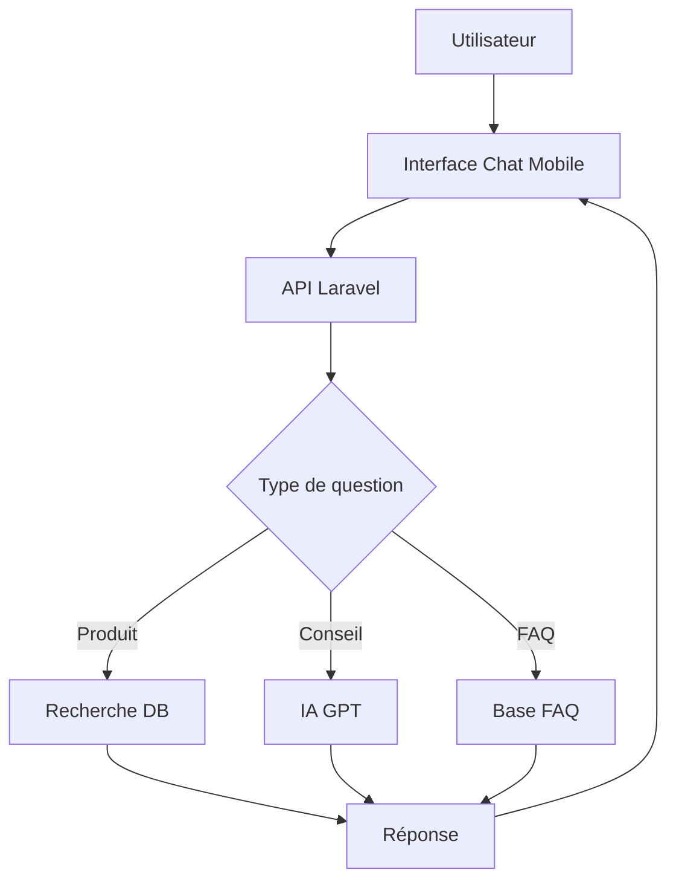

# 📚 DOCUMENTATION SOUTENANCE - PARTIE 3: CHATBOT & IA

## 🤖 ASSISTANT VIRTUEL / CHATBOT

### Vue d'ensemble

**Objectif:** Assister les utilisateurs dans leurs recherches et questions sur les médicaments

**Technologies:**
- Backend: Laravel (API REST)
- IA: OpenAI GPT / Dialogflow (à implémenter)
- Base de connaissances: Base de données produits + FAQ

---

## 1️⃣ ARCHITECTURE DU CHATBOT

### Architecture proposée



### Composants

| Composant | Rôle | Technologie |
|-----------|------|-------------|
| **Interface** | Chat UI | React Native |
| **API** | Routage requêtes | Laravel |
| **NLP** | Compréhension | OpenAI GPT-3.5 |
| **Base de connaissances** | Données produits | MySQL |
| **Cache** | Réponses fréquentes | Redis |

---

## 2️⃣ IMPLÉMENTATION (PROPOSITION)

### Service Chatbot

**Fichier:** `app/Services/ChatbotService.php`

```php
<?php

namespace App\Services;

use App\Models\Produit;
use App\Models\ConseilSante;
use Illuminate\Support\Facades\Http;
use Illuminate\Support\Facades\Cache;

class ChatbotService
{
    private $openaiApiKey;
    
    public function __construct()
    {
        $this->openaiApiKey = env('OPENAI_API_KEY');
    }
    
    /**
     * Traiter une question utilisateur
     */
    public function traiterQuestion($question, $userId = null)
    {
        // 1. Détecter l'intention
        $intention = $this->detecterIntention($question);
        
        // 2. Router vers le bon handler
        switch ($intention) {
            case 'recherche_produit':
                return $this->rechercherProduit($question);
                
            case 'conseil_sante':
                return $this->donnerConseil($question);
                
            case 'pharmacie_proche':
                return $this->trouverPharmacie($question, $userId);
                
            case 'prix_medicament':
                return $this->obtenirPrix($question);
                
            case 'disponibilite':
                return $this->verifierDisponibilite($question);
                
            default:
                return $this->reponseGenerique($question);
        }
    }
    
    /**
     * Détecter l'intention avec OpenAI
     */
    private function detecterIntention($question)
    {
        // Cache pour éviter appels API répétés
        $cacheKey = 'intention_' . md5($question);
        
        return Cache::remember($cacheKey, 3600, function() use ($question) {
            $response = Http::withHeaders([
                'Authorization' => 'Bearer ' . $this->openaiApiKey,
                'Content-Type' => 'application/json',
            ])->post('https://api.openai.com/v1/chat/completions', [
                'model' => 'gpt-3.5-turbo',
                'messages' => [
                    [
                        'role' => 'system',
                        'content' => 'Tu es un assistant qui détecte l\'intention. Réponds uniquement par: recherche_produit, conseil_sante, pharmacie_proche, prix_medicament, disponibilite, ou autre.'
                    ],
                    [
                        'role' => 'user',
                        'content' => $question
                    ]
                ],
                'max_tokens' => 10,
                'temperature' => 0.3
            ]);
            
            if ($response->successful()) {
                $intention = trim($response->json()['choices'][0]['message']['content']);
                return $intention;
            }
            
            return 'autre';
        });
    }
    
    /**
     * Rechercher un produit
     */
    private function rechercherProduit($question)
    {
        // Extraire le nom du produit de la question
        $nomProduit = $this->extraireNomProduit($question);
        
        // Recherche dans la base
        $produits = Produit::where('nom_produit', 'LIKE', "%{$nomProduit}%")
            ->orWhere('description', 'LIKE', "%{$nomProduit}%")
            ->limit(5)
            ->get();
        
        if ($produits->isEmpty()) {
            return [
                'type' => 'texte',
                'message' => "Je n'ai pas trouvé de produit correspondant à '{$nomProduit}'. Pouvez-vous reformuler?",
                'suggestions' => [
                    'Voir tous les médicaments',
                    'Parler à un pharmacien',
                    'Rechercher une pharmacie'
                ]
            ];
        }
        
        return [
            'type' => 'produits',
            'message' => "Voici les produits trouvés pour '{$nomProduit}':",
            'produits' => $produits->map(function($p) {
                return [
                    'id' => $p->id,
                    'nom' => $p->nom_produit,
                    'prix' => $p->prix,
                    'description' => $p->description,
                    'image' => $p->image_url
                ];
            }),
            'actions' => [
                ['label' => 'Voir détails', 'action' => 'voir_produit'],
                ['label' => 'Trouver en pharmacie', 'action' => 'localiser']
            ]
        ];
    }
    
    /**
     * Donner un conseil santé
     */
    private function donnerConseil($question)
    {
        // 1. Chercher dans les conseils existants
        $conseils = ConseilSante::where('titre', 'LIKE', "%{$question}%")
            ->orWhere('contenu', 'LIKE', "%{$question}%")
            ->first();
        
        if ($conseils) {
            return [
                'type' => 'conseil',
                'message' => $conseils->contenu,
                'source' => 'Base de connaissances',
                'disclaimer' => 'Ce conseil est informatif. Consultez un professionnel de santé.'
            ];
        }
        
        // 2. Utiliser OpenAI pour générer une réponse
        $response = Http::withHeaders([
            'Authorization' => 'Bearer ' . $this->openaiApiKey,
        ])->post('https://api.openai.com/v1/chat/completions', [
            'model' => 'gpt-3.5-turbo',
            'messages' => [
                [
                    'role' => 'system',
                    'content' => 'Tu es un assistant santé. Donne des conseils généraux et rappelle toujours de consulter un médecin. Sois concis (max 150 mots).'
                ],
                [
                    'role' => 'user',
                    'content' => $question
                ]
            ],
            'max_tokens' => 200,
            'temperature' => 0.7
        ]);
        
        if ($response->successful()) {
            $conseil = $response->json()['choices'][0]['message']['content'];
            
            return [
                'type' => 'conseil',
                'message' => $conseil,
                'source' => 'Assistant IA',
                'disclaimer' => '⚠️ Ce conseil est informatif. Consultez un professionnel de santé pour un diagnostic.',
                'actions' => [
                    ['label' => 'Trouver un pharmacien', 'action' => 'localiser_pharmacie'],
                    ['label' => 'Voir produits recommandés', 'action' => 'produits_similaires']
                ]
            ];
        }
        
        return [
            'type' => 'erreur',
            'message' => 'Désolé, je ne peux pas répondre pour le moment. Contactez un pharmacien.'
        ];
    }
    
    /**
     * Trouver une pharmacie proche
     */
    private function trouverPharmacie($question, $userId)
    {
        // Récupérer la position de l'utilisateur
        $user = \App\Models\User::find($userId);
        
        if (!$user || !$user->derniere_latitude) {
            return [
                'type' => 'demande_localisation',
                'message' => 'J\'ai besoin de votre position pour trouver les pharmacies proches.',
                'action' => 'demander_localisation'
            ];
        }
        
        // Utiliser le service de géolocalisation
        $geoService = new GeolocationService();
        $pharmacies = $geoService->findNearbyPharmacies(
            $user->derniere_latitude,
            $user->derniere_longitude,
            5 // 5km de rayon
        );
        
        return [
            'type' => 'pharmacies',
            'message' => 'Voici les pharmacies proches de vous:',
            'pharmacies' => $pharmacies,
            'actions' => [
                ['label' => 'Voir sur la carte', 'action' => 'ouvrir_carte'],
                ['label' => 'Appeler', 'action' => 'appeler']
            ]
        ];
    }
    
    /**
     * Obtenir le prix d'un médicament
     */
    private function obtenirPrix($question)
    {
        $nomProduit = $this->extraireNomProduit($question);
        
        $produit = Produit::where('nom_produit', 'LIKE', "%{$nomProduit}%")->first();
        
        if (!$produit) {
            return [
                'type' => 'texte',
                'message' => "Je n'ai pas trouvé le prix pour '{$nomProduit}'."
            ];
        }
        
        // Trouver les pharmacies qui ont ce produit
        $pharmaciesAvecPrix = \DB::table('produit_pharmacie')
            ->join('pharmacies', 'pharmacies.id', '=', 'produit_pharmacie.pharmacie_id')
            ->where('produit_pharmacie.produit_id', $produit->id)
            ->where('produit_pharmacie.quantite_disponible', '>', 0)
            ->select('pharmacies.nom_pharmacie', 'produit_pharmacie.prix_unitaire')
            ->get();
        
        return [
            'type' => 'prix',
            'message' => "Prix de {$produit->nom_produit}:",
            'prix_moyen' => $produit->prix,
            'pharmacies' => $pharmaciesAvecPrix,
            'actions' => [
                ['label' => 'Réserver', 'action' => 'reserver'],
                ['label' => 'Comparer les prix', 'action' => 'comparer']
            ]
        ];
    }
    
    /**
     * Vérifier disponibilité
     */
    private function verifierDisponibilite($question)
    {
        $nomProduit = $this->extraireNomProduit($question);
        
        $produit = Produit::where('nom_produit', 'LIKE', "%{$nomProduit}%")->first();
        
        if (!$produit) {
            return [
                'type' => 'texte',
                'message' => "Produit non trouvé."
            ];
        }
        
        $pharmaciesDisponibles = \DB::table('produit_pharmacie')
            ->join('pharmacies', 'pharmacies.id', '=', 'produit_pharmacie.pharmacie_id')
            ->where('produit_pharmacie.produit_id', $produit->id)
            ->where('produit_pharmacie.quantite_disponible', '>', 0)
            ->select('pharmacies.*', 'produit_pharmacie.quantite_disponible')
            ->get();
        
        if ($pharmaciesDisponibles->isEmpty()) {
            return [
                'type' => 'indisponible',
                'message' => "{$produit->nom_produit} n'est pas disponible actuellement.",
                'actions' => [
                    ['label' => 'M\'alerter quand disponible', 'action' => 'alerte'],
                    ['label' => 'Voir produits similaires', 'action' => 'similaires']
                ]
            ];
        }
        
        return [
            'type' => 'disponibilite',
            'message' => "{$produit->nom_produit} est disponible dans {$pharmaciesDisponibles->count()} pharmacie(s):",
            'pharmacies' => $pharmaciesDisponibles,
            'actions' => [
                ['label' => 'Réserver', 'action' => 'reserver'],
                ['label' => 'Voir sur carte', 'action' => 'carte']
            ]
        ];
    }
    
    /**
     * Réponse générique avec IA
     */
    private function reponseGenerique($question)
    {
        $response = Http::withHeaders([
            'Authorization' => 'Bearer ' . $this->openaiApiKey,
        ])->post('https://api.openai.com/v1/chat/completions', [
            'model' => 'gpt-3.5-turbo',
            'messages' => [
                [
                    'role' => 'system',
                    'content' => 'Tu es un assistant de pharmacie. Aide les utilisateurs avec leurs questions sur les médicaments, la santé, et les pharmacies. Sois concis et professionnel.'
                ],
                [
                    'role' => 'user',
                    'content' => $question
                ]
            ],
            'max_tokens' => 150
        ]);
        
        if ($response->successful()) {
            return [
                'type' => 'texte',
                'message' => $response->json()['choices'][0]['message']['content'],
                'suggestions' => [
                    'Rechercher un médicament',
                    'Trouver une pharmacie',
                    'Parler à un pharmacien'
                ]
            ];
        }
        
        return [
            'type' => 'erreur',
            'message' => 'Désolé, je ne peux pas répondre. Essayez de reformuler ou contactez un pharmacien.'
        ];
    }
    
    /**
     * Extraire le nom du produit de la question
     */
    private function extraireNomProduit($question)
    {
        // Méthode simple: enlever les mots communs
        $motsCommuns = ['le', 'la', 'les', 'un', 'une', 'des', 'prix', 'coût', 'combien', 'où', 'trouver', 'acheter', 'disponible'];
        
        $mots = explode(' ', strtolower($question));
        $mots = array_diff($mots, $motsCommuns);
        
        return implode(' ', $mots);
    }
}
```

---

## 3️⃣ CONTRÔLEUR API

**Fichier:** `app/Http/Controllers/Api/ChatbotController.php`

```php
<?php

namespace App\Http\Controllers\Api;

use App\Http\Controllers\Controller;
use App\Services\ChatbotService;
use Illuminate\Http\Request;

class ChatbotController extends Controller
{
    private $chatbotService;
    
    public function __construct(ChatbotService $chatbotService)
    {
        $this->chatbotService = $chatbotService;
    }
    
    /**
     * Envoyer un message au chatbot
     */
    public function message(Request $request)
    {
        $validated = $request->validate([
            'message' => 'required|string|max:500',
            'conversation_id' => 'nullable|string'
        ]);
        
        $userId = $request->user() ? $request->user()->id : null;
        
        // Traiter la question
        $reponse = $this->chatbotService->traiterQuestion(
            $validated['message'],
            $userId
        );
        
        // Sauvegarder l'historique
        if ($userId) {
            \App\Models\ChatHistory::create([
                'user_id' => $userId,
                'conversation_id' => $validated['conversation_id'] ?? uniqid(),
                'message_user' => $validated['message'],
                'message_bot' => json_encode($reponse),
                'intention' => $reponse['type'] ?? 'autre'
            ]);
        }
        
        return response()->json($reponse);
    }
    
    /**
     * Obtenir l'historique de conversation
     */
    public function historique(Request $request)
    {
        $historique = \App\Models\ChatHistory::where('user_id', $request->user()->id)
            ->orderBy('created_at', 'desc')
            ->limit(50)
            ->get();
        
        return response()->json($historique);
    }
    
    /**
     * Suggestions de questions
     */
    public function suggestions()
    {
        return response()->json([
            'suggestions' => [
                'Où trouver du paracétamol?',
                'Quelle pharmacie est de garde?',
                'Quel est le prix de l\'aspirine?',
                'Conseils pour un rhume',
                'Pharmacies ouvertes maintenant'
            ]
        ]);
    }
}
```

---

## 4️⃣ ROUTES API

**Fichier:** `routes/api.php`

```php
// Chatbot (accessible sans auth pour questions générales)
Route::prefix('chatbot')->group(function () {
    Route::post('/message', [ChatbotController::class, 'message']);
    Route::get('/suggestions', [ChatbotController::class, 'suggestions']);
});

// Historique (nécessite auth)
Route::middleware('auth:sanctum')->group(function () {
    Route::get('/chatbot/historique', [ChatbotController::class, 'historique']);
});
```

---

## 5️⃣ MODÈLE DE DONNÉES

**Migration:** `database/migrations/xxxx_create_chat_history_table.php`

```php
Schema::create('chat_history', function (Blueprint $table) {
    $table->id();
    $table->foreignId('user_id')->nullable()->constrained()->onDelete('cascade');
    $table->string('conversation_id');
    $table->text('message_user');
    $table->json('message_bot');
    $table->string('intention')->nullable();
    $table->timestamps();
    
    $table->index(['user_id', 'conversation_id']);
});
```

**Modèle:** `app/Models/ChatHistory.php`

```php
<?php

namespace App\Models;

use Illuminate\Database\Eloquent\Model;

class ChatHistory extends Model
{
    protected $table = 'chat_history';
    
    protected $fillable = [
        'user_id',
        'conversation_id',
        'message_user',
        'message_bot',
        'intention'
    ];
    
    protected $casts = [
        'message_bot' => 'array'
    ];
    
    public function user()
    {
        return $this->belongsTo(User::class);
    }
}
```

---

## 6️⃣ INTERFACE MOBILE (REACT NATIVE)

**Composant Chat:**

```javascript
import React, { useState } from 'react';
import { View, TextInput, FlatList, Text } from 'react-native';
import axios from 'axios';

const ChatbotScreen = () => {
  const [messages, setMessages] = useState([]);
  const [inputText, setInputText] = useState('');
  
  const envoyerMessage = async () => {
    if (!inputText.trim()) return;
    
    // Ajouter message utilisateur
    const userMessage = { type: 'user', text: inputText };
    setMessages([...messages, userMessage]);
    
    try {
      // Appel API
      const response = await axios.post('/api/chatbot/message', {
        message: inputText
      });
      
      // Ajouter réponse bot
      const botMessage = { type: 'bot', data: response.data };
      setMessages([...messages, userMessage, botMessage]);
      
      setInputText('');
    } catch (error) {
      console.error('Erreur chatbot:', error);
    }
  };
  
  const renderMessage = ({ item }) => {
    if (item.type === 'user') {
      return (
        <View style={styles.userMessage}>
          <Text>{item.text}</Text>
        </View>
      );
    }
    
    // Rendu selon le type de réponse
    switch (item.data.type) {
      case 'texte':
        return <Text>{item.data.message}</Text>;
        
      case 'produits':
        return (
          <View>
            <Text>{item.data.message}</Text>
            {item.data.produits.map(p => (
              <ProduitCard key={p.id} produit={p} />
            ))}
          </View>
        );
        
      case 'pharmacies':
        return <PharmaciesList pharmacies={item.data.pharmacies} />;
        
      default:
        return <Text>{item.data.message}</Text>;
    }
  };
  
  return (
    <View style={styles.container}>
      <FlatList
        data={messages}
        renderItem={renderMessage}
        keyExtractor={(item, index) => index.toString()}
      />
      
      <View style={styles.inputContainer}>
        <TextInput
          value={inputText}
          onChangeText={setInputText}
          placeholder="Posez votre question..."
          style={styles.input}
        />
        <Button title="Envoyer" onPress={envoyerMessage} />
      </View>
    </View>
  );
};
```

---

## 7️⃣ FONCTIONNALITÉS AVANCÉES

### 1. Reconnaissance vocale

```javascript
import Voice from '@react-native-voice/voice';

const demarrerReconnaissanceVocale = async () => {
  try {
    await Voice.start('fr-FR');
  } catch (error) {
    console.error(error);
  }
};

Voice.onSpeechResults = (e) => {
  setInputText(e.value[0]);
  envoyerMessage();
};
```

### 2. Suggestions intelligentes

```php
public function suggestionsPersonnalisees($userId)
{
    // Basé sur l'historique
    $historique = ChatHistory::where('user_id', $userId)
        ->orderBy('created_at', 'desc')
        ->limit(10)
        ->get();
    
    // Analyser les intentions fréquentes
    $intentions = $historique->pluck('intention')->unique();
    
    $suggestions = [];
    if ($intentions->contains('recherche_produit')) {
        $suggestions[] = 'Voir mes produits favoris';
    }
    if ($intentions->contains('pharmacie_proche')) {
        $suggestions[] = 'Pharmacies de garde près de moi';
    }
    
    return $suggestions;
}
```

### 3. Feedback utilisateur

```php
public function feedback(Request $request)
{
    $validated = $request->validate([
        'message_id' => 'required|exists:chat_history,id',
        'utile' => 'required|boolean',
        'commentaire' => 'nullable|string'
    ]);
    
    ChatHistory::find($validated['message_id'])->update([
        'feedback_utile' => $validated['utile'],
        'feedback_commentaire' => $validated['commentaire']
    ]);
    
    return response()->json(['message' => 'Merci pour votre feedback']);
}
```

---

## 📊 QUESTIONS FRÉQUENTES DU JURY

### Q1: Pourquoi utiliser OpenAI plutôt qu'un chatbot classique?

**Réponse:**
- Compréhension naturelle du langage
- Pas besoin de définir tous les scénarios
- Réponses contextuelles et personnalisées
- Apprentissage continu
- Multilingue (français, wolof, etc.)

### Q2: Comment gérez-vous les coûts de l'API OpenAI?

**Réponse:**
- Cache des réponses fréquentes (Redis)
- Limite de tokens (150 max par réponse)
- Fallback sur base de connaissances locale
- Modèle gpt-3.5-turbo (moins cher que GPT-4)
- Monitoring des coûts avec alertes

### Q3: Comment assurez-vous la fiabilité des conseils santé?

**Réponse:**
- Disclaimer systématique
- Validation par pharmaciens
- Base de connaissances vérifiée
- Pas de diagnostic médical
- Redirection vers professionnel si nécessaire

### Q4: Que se passe-t-il si l'API OpenAI est down?

**Réponse:**
- Fallback sur réponses pré-définies
- Base de connaissances locale (FAQ)
- Message d'erreur gracieux
- Suggestion de contacter un pharmacien
- Retry automatique avec backoff

### Q5: Comment mesurez-vous la satisfaction?

**Réponse:**
- Boutons "Utile/Pas utile" après chaque réponse
- Taux de résolution (question résolue sans escalade)
- Temps de réponse moyen
- Nombre de questions par conversation
- Analytics des intentions les plus fréquentes
